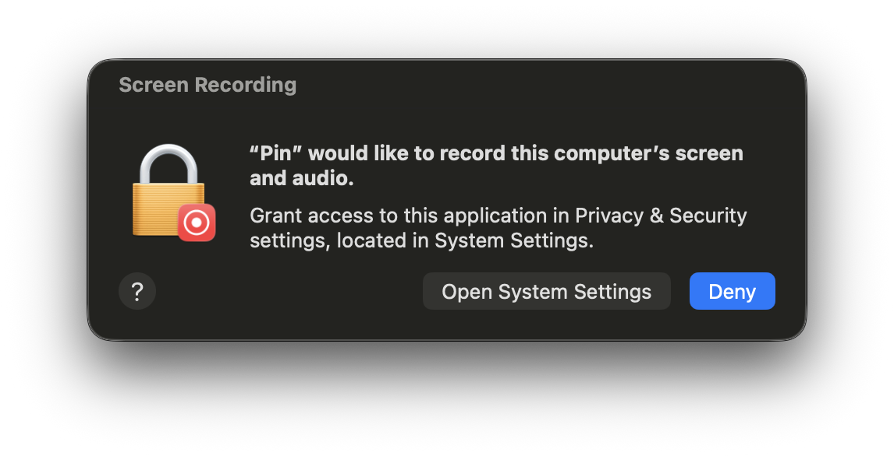
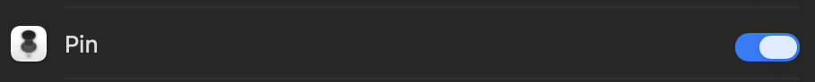

# Pin

  

  <strong>Keep any window always on top on macOS</strong>

---

## ✨ Features

- 🪟 **Pin Any Window** - Select any window and keep it always visible on top
- 🖱️ **Smart Hover** - Hover over the pinned window to make it transparent and interact with windows below
- 📋 **Menu Bar Control** - Easily select and manage windows from the menu bar
- 🔄 **Real-time Sync** - Follows the original window's position and size changes
- 🔔 **Auto Updates** - Built-in automatic updates via Sparkle

## 📥 Installation

### Download

👉 [**Download Pin v0.1.0**](https://github.com/southflowpeak/Pin/releases/download/v0.1.0/Pin-v0.1.0.zip)

### System Requirements

- macOS 14.0 (Sonoma) or later

### 🔐 Screen Recording Permission

Pin requires **Screen Recording** permission to function.

  

On first launch, you'll see the dialog above. Click "Open System Settings" and enable Pin in the Privacy & Security settings.

  

#### 💡 Why is Screen Recording permission required?

Pin uses macOS's **ScreenCaptureKit API** to keep windows on top:

1. **SCStream** captures the target window's content in real-time
2. The captured frames are displayed using **AVSampleBufferDisplayLayer**
3. This layer is placed in a floating window set to `NSWindow.Level.floating`

This creates a "mirror window" that stays on top even when the original window is behind other windows. Since ScreenCaptureKit is used to capture window content, macOS requires Screen Recording permission.

## 🚀 Usage

1. Click the 📌 icon in the menu bar
2. Select "Pin Window..." and choose the window you want to pin
3. To unpin, click the pin icon on the top-left of the mirror window, or select "Unpin" from the menu

## 📄 License

MIT License
